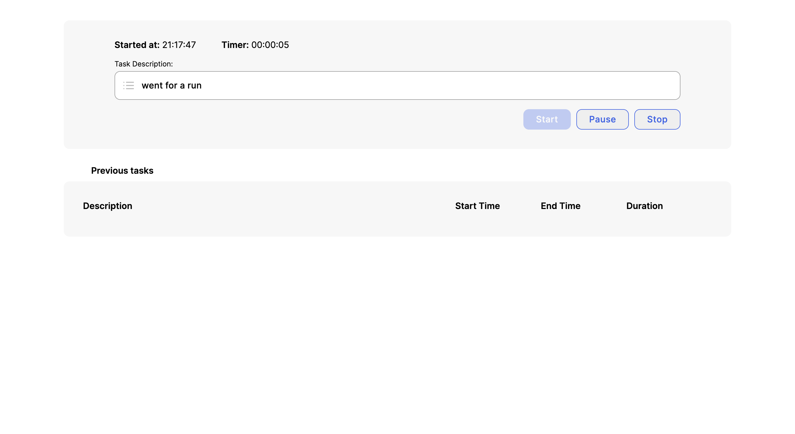
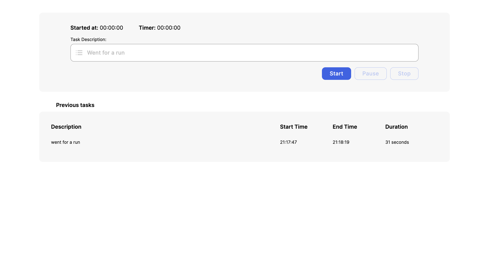

# Time Tracker - Roswell Studios Challenge

#### Description

The challenge is to create a dynamic time tracking application so that users can track tasks with awareness of how long each task takes.
### Project initialization

To start with this project, first clone this repo and run the following command:

```js
yarn install
```

To run it: 
```js
yarn run dev
```

### Project view




### See live project

[Live project](https://vercel.com/larasabatini/roswell-studios)
